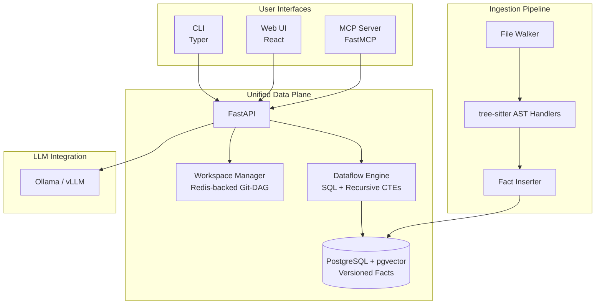
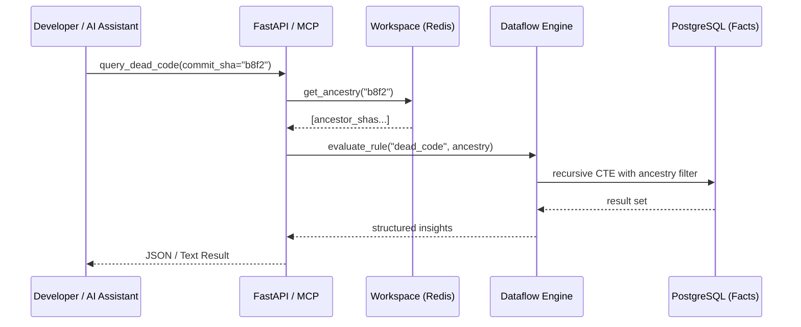

# Code Intelligence Platform (Code-Intel)

Code-Intel is a production-ready, bi-temporal code intelligence platform built on a **Unified Data Plane**. It tracks code structure directly against a Git Directed Acyclic Graph (DAG) using a topological schema, enabling sub-millisecond historical queries, impact analysis, and LLM-driven requirements generation.

## 🏗️ Architecture Overview

The system integrates source code ingestion, atomic fact storage in a versioned SQL database, and declarative insights via a Git-aware dataflow engine.



## 🚀 Key Features

- **Unified Fact Model**: All code data (symbols, calls, data flows) stored as versioned relational facts.
- **Git-DAG Topological Schema**: Native support for branches, merges, and rebases using `introduced_in`, `modified_in`, and `deleted_in` metadata.
- **MCP-Native**: First-class Model Context Protocol (MCP) server for seamless integration with AI assistants like Claude Code.
- **Declarative Analysis**: New analyses (e.g., dead code, impact) are simple SQL views, not complex code.
- **LLM as a UDF**: Requirements generation is a first-class query inside the database flow.

## 🔄 System Flow



## 🛠️ Setup

```bash
# Clone or create project
./create-project-uv-prod.sh

# Start all services (Linux/macOS). On Windows use a compatible container runtime.
podman-compose up -d

# Run database migrations
podman exec -it codeintel-api alembic upgrade head

# Pull a model into Ollama
podman exec -it codeintel-ollama ollama pull phi3:mini
```

## Usage

- API docs: http://localhost:8000/docs
- Analyze a repo:
	```bash
	curl -X POST http://localhost:8000/analyze \
		-H "Content-Type: application/json" \
		-d '{"repo_path": "/repo"}'
	```
- Query dead code:
	```bash
	curl -X POST http://localhost:8000/query \
		-H "Content-Type: application/json" \
		-d '{"rule": "dead_code"}'
	```
- Generate requirements:
	```bash
	curl -X POST http://localhost:8000/requirements
	```

## Documentation Index

The repository documentation set lives under [docs](docs):

- [docs/code-intel-design.md](docs/code-intel-design.md) — high-level system design and architecture notes.
- [docs/code-intel-nxt.md](docs/code-intel-nxt.md) — next-step roadmap and product direction.
- [docs/conde-intel-nxt-prompts.md](docs/conde-intel-nxt-prompts.md) — prompt and workflow notes for the next-generation experience.
- [docs/how-code-intel-is-different.md](docs/how-code-intel-is-different.md) — explanation of the platform’s differentiators.
- [docs/mcp-ui-foundations.md](docs/mcp-ui-foundations.md) — current MCP server and UI foundation status.
- [docs/engine_benchmark_results.md](docs/engine_benchmark_results.md) — latest graph engine benchmark report.
- [docs/schema/git_dag_schema.yaml](docs/schema/git_dag_schema.yaml) — Git-DAG schema definition.

## MCP and UI Foundations

For the local MCP server, workspace-info tool, and the initial three-panel UI shell, see [docs/mcp-ui-foundations.md](docs/mcp-ui-foundations.md).

## Graph Engine Benchmarking

To compare the mock Git-DAG query path for Memtrace and TerminusDB, run:

```bash
uv run python scripts/evaluate_graph_engines.py --runs 5
```

The script launches lightweight container-backed mock servers, populates them with synthetic commit and code-edge data, executes a topological ancestry lookup plus an edge filter, and writes a markdown comparison report to [docs/engine_benchmark_results.md](docs/engine_benchmark_results.md). CI also runs a smoke-test version of this workflow to keep the benchmark path covered automatically.

## Production Considerations

- Replace `postgres` with Azure Database for PostgreSQL Flexible Server.
- Replace `redis` with Azure Cache for Redis.
- Replace `ollama` with vLLM on GPU nodes.
- Use a reverse proxy (Nginx) with HTTPS and authentication.
- Set up monitoring with Prometheus + Grafana.

## Notes

- The repository contains `pyproject.toml` and other project files; check them for dependency and packaging guidance.
- If you want a local development flow using `venv` and Python tools instead of containers, tell me and I can add a "Local development" section with commands.
