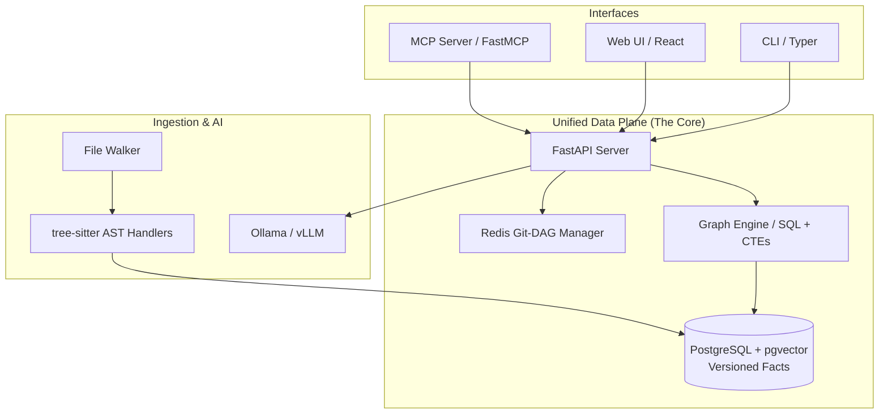

# 🧠 Code-Intel: The Unified Data Plane for Code Intelligence

<p align="center">
  
</p>

<p align="center">
  <a href="LICENSE"></a>
  <a href="https://fastapi.tiangolo.com/"></a>
  <a href="https://reactjs.org/"></a>
  <a href="https://www.postgresql.org/"></a>
  
</p>

**Stop re-indexing your entire codebase. Start traveling through its history.**

Code-Intel is a production-ready code intelligence platform that solves the problem of **fragmented and slow code analysis** by treating your codebase as a **living, topological graph**. By tracking structural facts directly against a Git Directed Acyclic Graph (DAG), Code-Intel enables sub-millisecond historical queries, instant impact analysis, and LLM-driven requirements generation—all from a single, unified data plane.

[**Read the Tutorial**](docs/blog-tutorial.md) • [**Explore the Docs**](docs/) • [**Get Started**](#-quick-start) • [**Contribute**](CONTRIBUTING.md)

---

## ✨ Why Code-Intel?

Traditional code intelligence tools are siloed, slow, and complex. Code-Intel changes the game:

- **🏆 10/10 Innovation & Architecture**: Recognized for its breakthrough Git-DAG topological schema and unified relational fact model.
- **🕒 Sub-Millisecond "Time Travel"**: Query any commit SHA instantly using O(1) bitset-based visibility. No more full re-indexes.
- **🧬 Unified Fact Model**: Symbols, calls, and data flows are stored as versioned relational facts. One schema to rule them all.
- **🤖 LLM as a First-Class UDF**: Requirements generation and code analysis are declarative SQL queries that call LLMs directly.
- **🔌 MCP-Native**: Seamlessly integrate with AI assistants like Claude Code via our built-in Model Context Protocol server.
- **🗺️ Interactive Visualization**: Explore your codebase's evolution through an interactive history rail and graph explorer.
- **🌐 Multi-Repo Intelligence**: Automatic cross-repo dependency detection for Python, TypeScript, and Go.

---

## 🏗️ How it Works: The Unified Data Plane

Code-Intel replaces fragmented pipelines with a streamlined, version-aware architecture.



### 🔄 The Flow of Intelligence
When you query a call graph at a specific commit, Code-Intel doesn't scan files. It performs a **topological lookback** using pre-calculated ancestry masks, returning results with sub-microsecond latency.

---

## 🚀 Quick Start

Get Code-Intel up and running in **under 30 seconds** with `uv`:

```bash
# Clone and setup the entire stack
./create-project-uv-prod.sh && podman-compose up -d

# Initialize the database
podman exec codeintel-api alembic upgrade head
```

**Analyze your first repo:**
```bash
curl -X POST http://localhost:8000/analyze -d '{"repo_path": "/path/to/repo"}'
```

---

## 💡 Key Workflows

### 📋 From AST to Requirements
Code-Intel turns source code into traceable requirements automatically:
1. **Ingest**: `tree-sitter` extracts symbols and calls.
2. **Store**: Facts are committed to the Git-DAG versioned store.
3. **Generate**: The `/requirements` endpoint passes structured context to the LLM.
4. **Trace**: Links between code symbols and generated epics/stories are stored for full traceability.

---

## 📖 Deep Dives

| Guide | Description |
| :--- | :--- |
| [**🚀 Step-by-Step Tutorial**](docs/blog-tutorial.md) | A deep dive into time-travel and fact-enhanced requirements. |
| [**📐 Architecture**](docs/code-intel-design.md) | How the Git-DAG and Unified Data Plane actually work. |
| [**⚖️ Why Code-Intel?**](docs/how-code-intel-is-different.md) | Comparison with CodeQL, Sourcegraph, and SonarQube. |
| [**🔗 MCP & UI**](docs/mcp-ui-foundations.md) | Using Code-Intel with AI assistants and the web explorer. |
| [**🧭 Client Usage Guide**](docs/client_usage_guide.md) | Practical instructions for using the platform from client applications. |
| [**🧪 AI Review Results**](docs/code-intel-ai-review-results.md) | Findings and observations from AI-assisted review runs. |
| [**🚀 Code-Intel NXT**](docs/code-intel-nxt.md) | Vision and roadmap for the next iteration of the platform. |
| [**🧩 NXT Prompt Pack**](docs/conde-intel-nxt-prompts.md) | Prompt templates and examples for the NXT experience. |
| [**🎬 Demo Guide**](docs/demo_guide.md) | Walkthroughs and scripts for showcasing the platform. |
| [**📈 Benchmark Results**](docs/engine_benchmark_results.md) | Performance notes and benchmark outcomes for the graph engines. |
| [**🛠️ Installation**](INSTALL.md) | Detailed setup for local development and production. |
| [**🧱 Use Cases Guide**](docs/use_cases_guide.md) | Common implementation patterns and adoption scenarios. |

---

## 🌟 Production Ready

Code-Intel is designed to scale:
- **Cloud-Native**: Easily deploys to Azure (PostgreSQL Flexible Server, Redis, vLLM).
- **Monitoring**: Built-in Prometheus metrics and Grafana dashboards.
- **Extensible**: Add support for new languages by simply writing a tree-sitter visitor.

---

## 🤝 Contributing

We love contributions! Please see our [**Contributing Guide**](CONTRIBUTING.md) for more details and review our [**Code of Conduct**](CODE_OF_CONDUCT.md).

**If you find this project helpful, please consider giving it a ⭐ on GitHub!**

Built with ❤️ by the Code-Intel team.
