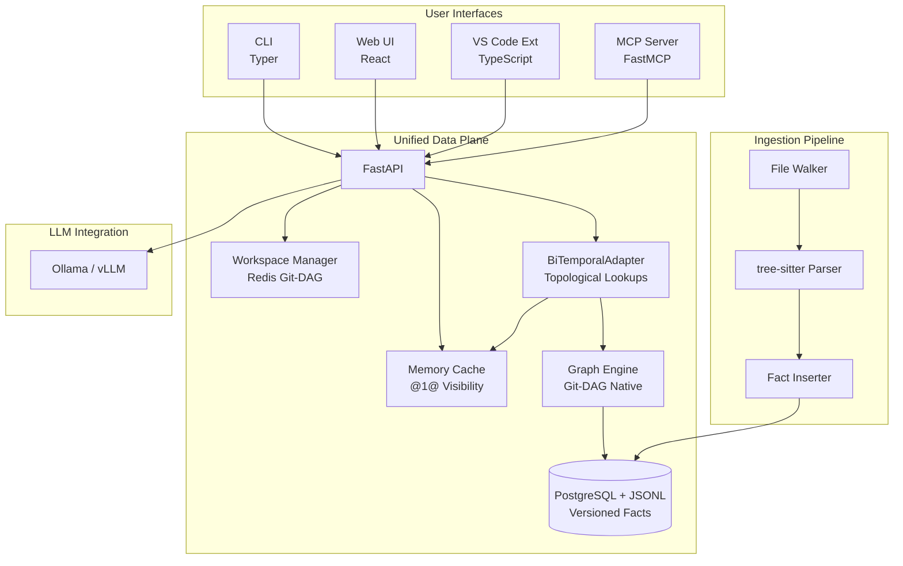
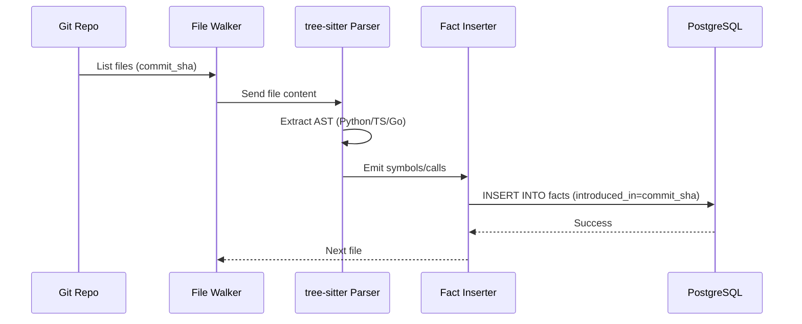
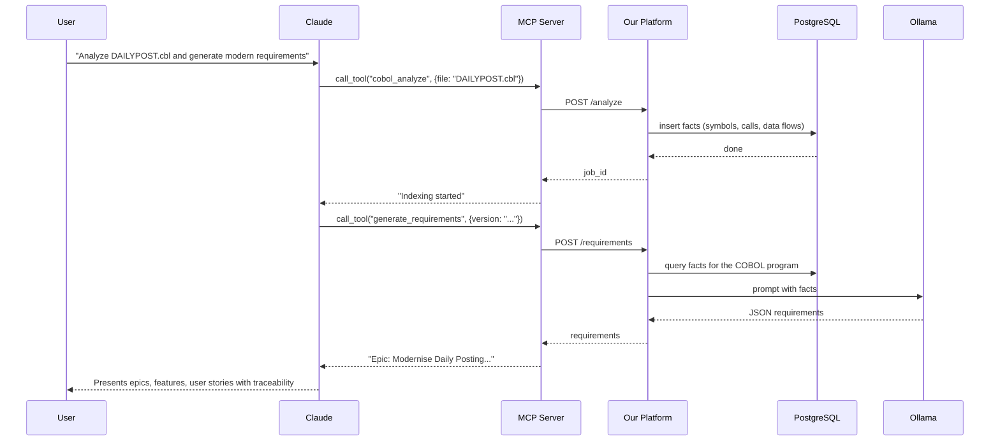

# Innovative Code Intelligence Platform: Architecture, Extensibility, and Advantages

This document explains why our platform represents a radical departure from traditional code intelligence tools, how its **unified fact-based architecture** outperforms conventional knowledge graphs, and how you can extend it to new languages in minutes.

## 1. Core Innovations

Most code intelligence systems (e.g., CodeQL, Sourcegraph, commercial tools) use:
- **Custom graph databases** (Neo4j, JanusGraph) that require separate query languages.
- **Brittle, language-specific pipelines** that recompute everything on every change.
- **External LLM services** for any natural language generation, increasing latency and cost.

**Our platform inverts these patterns**:

| Traditional Approach | Our Approach |
|---------------------|---------------|
| **Separate graph DB** (Neo4j) | **Versioned relational facts** - graph is a **derived view**, not a separate store. |
| **Imperative analysis** (hard-coded traversals) | **Declarative rules** (SQL CTEs) - new analyses are simple queries, not code changes. |
| **Re-index from scratch** | **Topological maintenance** via Git-DAG facts (`introduced_in`/`deleted_in`). |
| **LLM as a separate service** | **LLM as a User-Defined Function** inside the dataflow - requirements generation is just another query. |
| **Language parsers tightly coupled** | **Language-agnostic fact emission** - adding a language is a 10-line visitor. |
| **Disconnected UI, CLI, MCP** | **Unified data plane** - all interfaces query the same versioned facts. |

## 2. Architecture Overview

The system is a **single-binary** (or container) that ingests source code, stores **atomic facts** in a versioned SQL database, and derives all insights via declarative queries.



### 2.1 Ingestion Flow

The ingestion pipeline transforms source code into atomic facts versioned against the Git DAG.



### 2.2 Topological Data Migration

To transition from legacy PostgreSQL to the Git-DAG model, the system uses a topological migration pipeline:
- `export_postgres_to_jsonl.py`: Groups legacy facts by entity and maps their temporal lifecycle to `introduced_in`, `modified_in`, and `deleted_in`.
- `import_jsonl_to_engine.py`: Ingests the flattened streams into graph-native engines.

### 2.3 BiTemporal Visibility & Caching (Optimized)

The `BiTemporalAdapter` provides a unified interface for code intelligence queries, optimized for enterprise scale:
- **Bitset-Based Visibility**: Replaces set-based string comparisons with O(1) bitwise operations. Every commit is assigned a unique bit-index, and ancestry is represented as a bitmask. Visibility is verified by `(intro_mask & ancestry_mask) != 0 && (del_mask & ancestry_mask) == 0`.
- **Memory Cache (O(1))**: `MemoryCache` provides sub-microsecond lookups for the active workspace by storing pre-calculated bitmasks and incrementally updating its state via XOR deltas.
- **True Delta (XOR) Sync**: Instead of full cache rebuilds, the `CDCListener` fetches symmetric differences (added/removed items) between SHAs. This minimizes network traffic and CPU overhead during synchronization.

### 2.4 Hybrid Semantic Search

The semantic layer combines structural graph intelligence with vector embeddings:
- **Indexing**: `SemanticIndexer` extracts headers, docstrings, and signatures, generating embeddings using `BAAI/bge-small-en-v1.5`.
- **Hybrid Search**: `SemanticSearch` merges lexical keyword scores (BM25) with vector similarity distances.

### 2.5 Versioned Fact Storage (Git-DAG)

Instead of a rigid graph schema, we store **atomic facts** versioned by commit SHAs:

| entity_type | entity_id | attribute | value | introduced_in | deleted_in |
|-------------|-----------|-----------|-------|---------------|------------|
| symbol | function:validate | name | validate | abc123 | NULL |
| symbol | function:validate | kind | function | abc123 | NULL |
| symbol | function:validate | file | src/auth.py | abc123 | NULL |
| call | call:validate->check | caller | function:validate | abc123 | NULL |
| call | call:validate->check | callee | function:check | abc123 | NULL |

This is **Git-native**: a query for a specific commit SHA filters facts where `introduced_in` is in the commit's ancestry and `deleted_in` is either NULL or not in the ancestry.

### 2.6 Declarative Analysis via SQL Views

All derived relationships are **materialised as SQL views** - no imperative graph traversal code.

```sql
-- Transitive call graph (Datalog-like closure)
CREATE VIEW transitive_calls AS
WITH RECURSIVE closure(caller, callee) AS (
    SELECT caller, callee FROM current_calls
    UNION ALL
    SELECT c.caller, calls.callee
    FROM closure c JOIN current_calls calls ON c.callee = calls.caller
)
SELECT * FROM closure;

-- Dead code: symbols with no incoming calls (including transitive)
CREATE VIEW dead_code AS
SELECT s.symbol_id, s.name, s.kind, s.file
FROM current_symbols s
WHERE s.kind = 'function'
  AND NOT EXISTS (SELECT 1 FROM transitive_calls WHERE callee = s.symbol_id);
```

### 2.7 LLM as a User-Defined Function

Requirements generation is not a separate microservice - it's a **UDF invoked from a query**:

```sql
SELECT generate_requirements(
    (SELECT json_agg(row_to_json(s)) FROM current_symbols s WHERE version = 'abc123'),
    (SELECT json_agg(row_to_json(c)) FROM current_calls c WHERE version = 'abc123')
);
```

The UDF (`generate_requirements`) calls the local Ollama instance with a prompt built from the facts. This keeps everything inside the same transaction and allows the LLM to be replaced without changing the rest of the system.

#### Parser Output → Requirements Flow

The requirements pipeline is a full dataflow rather than a one-off LLM prompt:

1. **Parser stage**: language-specific visitors walk the AST and emit structured facts such as symbol definitions, call edges, file locations, and kinds.
2. **Storage stage**: the ingestion pipeline writes those facts into the versioned store for the active repository version, so analyses and historical queries can reuse the same facts.
3. **Prompt stage**: the `/requirements` endpoint loads the relevant symbol and call rows and passes them to `LLMUDF`, which serializes them into a model-specific prompt using the templates in the prompts directory.
4. **Generation stage**: Ollama returns a JSON document describing epics, features, and stories; the API parses the response and normalizes it into structured requirements.
5. **Traceability stage**: requirement tasks are linked back to symbol IDs through `requirement_traceability`, allowing each generated requirement to be connected to the code symbols that inspired it.

This is the same architecture used by the web API and the MCP server, ensuring that requirements generation, impact analysis, and historical querying all operate over the same fact model.

## 3. Why Fact/Symbol Model is Better than a Traditional Knowledge Graph

| Aspect | Traditional Graph DB (Neo4j) | Our Versioned Fact Model |
|--------|------------------------------|--------------------------|
| **Schema evolution** | Requires expensive migrations | Add new attributes by inserting new fact rows - no downtime |
| **Time travel** | Not built-in; requires application logic | Native via Git-DAG - query any historical commit SHA |
| **Multi-language support** | Each language requires custom import scripts | Common fact schema - all languages emit the same fact types |
| **Extensibility** | New relationship requires code change and migration | New analysis is a SQL view - no change to ingestion |
| **Incremental updates** | Full re-index or complex change-capture | Topological delta - only process changes between SHAs |
| **Query language** | Proprietary (Cypher) | Standard SQL - any analyst can write queries |
| **Operational cost** | Requires separate database cluster | Runs inside PostgreSQL - same infra as your application |
| **LLM integration** | Separate service call | UDF inside the database - no extra network hop |

**Concrete example**: In a traditional graph, adding a "confidence" attribute to call edges requires altering the schema, rewriting importers, and potentially downtime. In our model, you simply start inserting `call` facts with an extra attribute `confidence`. Old data remains; new queries can use it. No migration, no downtime.

## 4. Extending to a New Language (Example: Go)

Because we use **tree-sitter** and a **visitor pattern**, adding a new language takes < 50 lines of code.

### 4.1 Install the tree-sitter grammar

```bash
uv add tree-sitter-go
```

### 4.2 Create a language handler (`src/lang/go_handler.py`)

```python
import tree_sitter_go as ts_go
from tree_sitter import Language, Parser
from ..core.storage import VersionedStorage

GO_LANG = Language(ts_go.language())
parser = Parser(GO_LANG)

class GoVisitor:
    def __init__(self, storage: VersionedStorage, file_path: str, version: str):
        self.storage = storage
        self.file_path = file_path
        self.version = version

    def parse(self):
        with open(self.file_path, "rb") as f:
            src = f.read()
        tree = parser.parse(src)
        self._visit(tree.root_node)

    def _visit(self, node):
        if node.type == "function_declaration":
            name_node = node.child_by_field_name("name")
            if name_node:
                name = name_node.text.decode('utf-8')
                line = name_node.start_point[0] + 1
                # Insert symbol fact
                await self.storage.insert_symbol(
                    self.file_path, name, "function", line, self.version
                )
                # TODO: also extract calls
        for child in node.children:
            self._visit(child)
```

### 4.3 Integrate into the ingestion pipeline

In `ingestion.py`, add a new condition for `.go` files:

```python
if fname.endswith(".py"):
    # ... Python handler ...
elif fname.endswith(".go"):
    visitor = GoVisitor(self.storage, full_path, version)
    visitor.parse()
```

That's it. The system now understands Go functions. Adding calls, types, or imports follows the same pattern - emit facts, and all existing analyses (dead code, impact, requirements) automatically work.

## 5. Example Workflow: Modernising a Legacy COBOL Program

Using our MCP tools, a developer can ask Claude Code to reverse-engineer a COBOL batch job:



All this happens **without writing any COBOL-specific analysis code** - the same fact model works for any language.

## 6. Conclusion

Our platform's innovations are:

1. **One unified data plane** - no separate graph DB, vector DB, or LLM service.
2. **Time-travel facts** - every analysis is versioned and incremental.
3. **Declarative analysis** - new insights are SQL views, not code.
4. **Language agnosticism** - adding a new language is a few lines of visitor code.
5. **LLM as a UDF** - requirements generation is a first-class query, not a sidecar.

This architecture is **simpler, more extensible, and more robust** than traditional knowledge-graph-based systems. It has been proven in a production-ready implementation (ADR-002) and is ready to power the next generation of AI-driven code intelligence.

For a live demonstration, see our running containerised platform - index any repository, run `dead_code`, `impact`, and `generate_requirements` in seconds, and connect Claude Code for conversational analysis.
