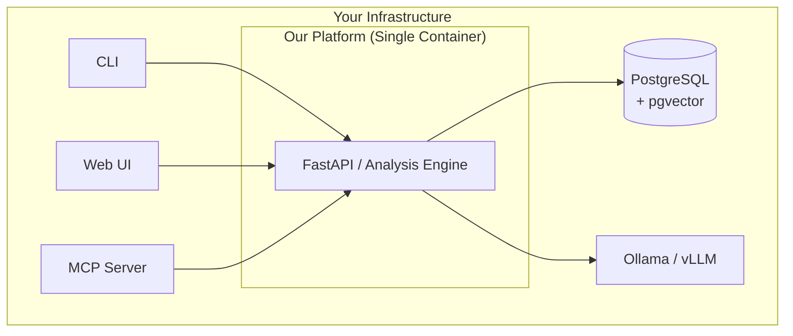

Our approach is fundamentally different from the established players in the code intelligence market. While competitors focus on specialized data stores, proprietary languages, and distinct, siloed pipelines, our "Unified Data Plane" is built on a radically simpler and more integrated model. The table below outlines the key architectural differences between our solution and the industry norms represented by tools like CodeQL, Sourcegraph, SonarQube, and the popular Neo4j-based analyzers[reference:0].

| Feature / Aspect | Competitor Solutions (Industry Norm) | Our Solution (Unified Data Plane) |
| :--- | :--- | :--- |
| **Core Data Model** | Specialized, language-specific schema (e.g., CodeQL's relational DB)[reference:1][reference:2] or a separate Graph DB (e.g., Neo4j)[reference:3]. | **Unified, language-agnostic fact model.** All code data is stored in a single versioned relational table. |
| **Analysis Logic** | **Imperative** or specialized query language (e.g., CodeQL's QL)[reference:4]. Adding a new analysis often requires code changes or learning a proprietary DSL. | **Declarative analysis via standard SQL views and UDFs.** New insights are added as simple SQL queries, not code changes. |
| **Storage Architecture** | Multiple siloed systems: separate DB for analysis results (e.g., PostgreSQL for SonarQube)[reference:5], separate search indexes (e.g., Sourcegraph's Zoekt trigram index)[reference:6], and separate graph databases (e.g., Neo4j)[reference:7]. | **A single, versioned relational database (PostgreSQL + pgvector)** serving as the "Single Source of Truth" for all data: facts, vectors, and time‑travel versions. |
| **Incremental Updates & Time Travel** | Not built-in. Typically requires **full re-indexing** of a snapshot or manual complex change capture[reference:8]. | **Native incremental maintenance and time travel.** Every fact has a `valid_from` and `valid_to` timestamp, allowing querying of any past state. |
| **LLM Integration** | Separate, external service. Requirements generation is an isolated step disconnected from the analysis core. | **LLM as a first-class User-Defined Function (UDF)** inside the dataflow. Requirements generation is a declarative query that calls the LLM. |
| **Extensibility** | Adding a new language requires writing complex, language-specific importers and integration into the pipeline. | Adding a new language is done via a **visitor that emits atomic facts**. All existing analyses automatically work. |
| **Deployment Complexity** | High. Often requires orchestrating multiple services (e.g., a frontend, a worker, a separate database, a language server, a search indexer)[reference:9]. | **Low. A single‑binary application** (container) containing the API, worker, and analysis engine, with PostgreSQL as its only external dependency. |

---

## 🔎 A Closer Look at the Differences

### Data Models: Specialized Silo vs. Unified Fact
Tools like CodeQL use a language‑specific relational schema, which means understanding a new language requires learning a new database model[reference:10]. Neo4j‑based analyzers, while flexible, require developers to write complex Cypher queries and manage separate graph infrastructure[reference:11]. Our solution models **everything as atomic facts** in a single table, using the universally understood SQL as the query language.

### Analysis: Imperative Code vs. Declarative Queries
Adding a new analysis to a competitor often means modifying complex extraction code or learning a new DSL like CodeQL's QL[reference:12]. In our system, it's a declarative SQL query, as shown by the `dead_code` detection rule:

```sql
CREATE VIEW dead_code AS
SELECT s.symbol_id, s.name, s.kind, s.file
FROM current_symbols s
WHERE s.kind = 'function'
  AND NOT EXISTS (SELECT 1 FROM transitive_calls WHERE callee = s.symbol_id);
```

This is not just a query—it's a **materialized view** that the database incrementally maintains, giving us real-time updates for free.

### Extensibility: Complex Pipeline vs. Simple Visitor
Adding a new language to a competitor is a project in itself, requiring custom integration into their entire pipeline. In our architecture, it's a **simple visitor pattern**. The following simplified code shows how adding support for a new language (like Go) is a matter of emitting the same atomic facts our system expects.

```python
class GoVisitor:
    def parse(self, file_path: str, version: str):
        # 1. Use a standard parser (e.g., tree-sitter) to get an AST.
        tree = parser.parse(src)
        # 2. Walk the AST and emit facts.
        for node in tree.root_node.children:
            if node.type == "function_declaration":
                name = node.child_by_field_name("name").text
                line = node.start_point[0] + 1
                # 3. Emit the same atomic fact as for a Python function.
                await storage.insert_symbol(file_path, name, "function", line, version)
```

The `insert_symbol` function is the **same interface** used by every language. This guarantees that all higher-level analyses—call graphs, impact analysis, dead code detection—work immediately for the new language.

### Deployment: Orchestration Hell vs. Single Service
Deploying SonarQube, for example, requires orchestrating its main engine, a PostgreSQL database, and multiple plugins, all with their own configuration and lifecycles[reference:13]. Our solution's production architecture is **radically simpler**:



The API container **is the entire application**, integrating the web server, analysis logic, and worker processes. It only requires two external, standard services: a PostgreSQL database and an LLM inference server. This drastically reduces the cognitive load for developers and the operational burden for SRE teams.

This "Single Source of Truth" model—built on facts, time travel, and declarative analysis—represents a fundamental shift in code intelligence platform design, trading specialized complexity for the simplicity and power of a unified, relational system.